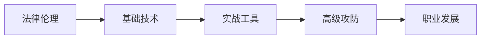

# 📚 红客初学者指南

> 从零开始，系统学习网络安全与渗透测试 — 涵盖法律伦理、基础技术、实战工具到职业发展的完整学习路线。

---

## 🗺️ 学习路线

---

## 📋 课程大纲

| # | 章节 | 难度 | 预计时间 | 核心技能 |
|---|------|------|---------|---------|
| 01 | 红客之道：法律、伦理与职业操守 | ⭐ | 60分钟 | 法律边界、职业道德、职业方向 |
| 02 | 搭建安全实验环境 | ⭐⭐ | 90分钟 | Kali Linux、虚拟机、靶机搭建 |
| 03 | Linux基础与命令行精通 | ⭐⭐ | 90分钟 | Linux文件系统、权限、Bash脚本 |
| 04 | 计算机网络基础深度解析 | ⭐⭐ | 60分钟 | OSI模型、TCP/IP、Wireshark |
| 05 | Python编程for Hackers | ⭐⭐ | 90分钟 | Socket编程、端口扫描、Exploit编写 |
| 06 | 信息收集与OSINT | ⭐⭐ | 60分钟 | WHOIS、子域名枚举、Google Hacking |
| 07 | 漏洞扫描与评估 | ⭐⭐⭐ | 60分钟 | Nmap、Nessus、CVE、CVSS |
| 08 | Web安全与OWASP Top 10 | ⭐⭐⭐ | 90分钟 | SQL注入、XSS、CSRF、SSRF |
| 09 | Burp Suite实战 | ⭐⭐⭐ | 90分钟 | Proxy、Repeater、Intruder、插件 |
| 10 | Metasploit Framework精通 | ⭐⭐⭐ | 90分钟 | msfconsole、Payload、Meterpreter |
| 11 | 权限提升（Privilege Escalation） | ⭐⭐⭐⭐ | 90分钟 | Linux/Windows提权、LinPEAS、WinPEAS |
| 12 | 密码学基础与密码攻击 | ⭐⭐⭐ | 60分钟 | 哈希算法、Hashcat、John the Ripper |
| 13 | 后渗透与横向移动 | ⭐⭐⭐⭐ | 90分钟 | mimikatz、Pass-the-Hash、横向移动 |
| 14 | Active Directory攻防 | ⭐⭐⭐⭐ | 90分钟 | Kerberos、BloodHound、Golden Ticket |
| 15 | 无线网络安全 | ⭐⭐⭐ | 60分钟 | WEP/WPA破解、Evil Twin、蓝牙安全 |
| 16 | 社会工程学实战 | ⭐⭐⭐ | 60分钟 | 钓鱼攻击、SET、物理安全评估 |
| 17 | 红队演练全流程 | ⭐⭐⭐⭐ | 90分钟 | ATT&CK框架、C2框架、报告撰写 |
| 18 | 认证体系与职业发展 | ⭐ | 60分钟 | OSCP、CEH、CTF、漏洞赏金、面试技巧 |

---

## 🚀 开始学习

点击左侧菜单中的任意章节，开始你的网络安全之旅！

> **⚠️ 法律声明**：本课程所有内容仅供合法授权的安全测试和学习使用。未经授权对他人系统进行攻击属于违法行为。请遵守《网络安全法》及相关法律法规。

---

## 🔗 相关资源

- 📖 [OWASP Top 10 2021](https://owasp.org/Top10/)
- 🎯 [PortSwigger Web Security Academy](https://portswigger.net/web-security)
- 🎮 [TryHackMe](https://tryhackme.com/)
- 🏆 [HackTheBox](https://www.hackthebox.com/)
- 📺 [IppSec YouTube](https://www.youtube.com/c/IppSec)

---

## 📊 课程统计

| 指标 | 数值 |
|------|------|
| 总章节数 | 18 章 |
| 总字数 | 约 90 万字 |
| 实验数量 | 70+ 个 |
| 涵盖工具 | 50+ 款 |

---

**祝你学习愉快，成为一名有道德、有技术的网络安全专家！** 🎉

---

*本课程由 QClaw 制作，内容持续更新中。*

---

  总访问量  次 |
  总访客  人

